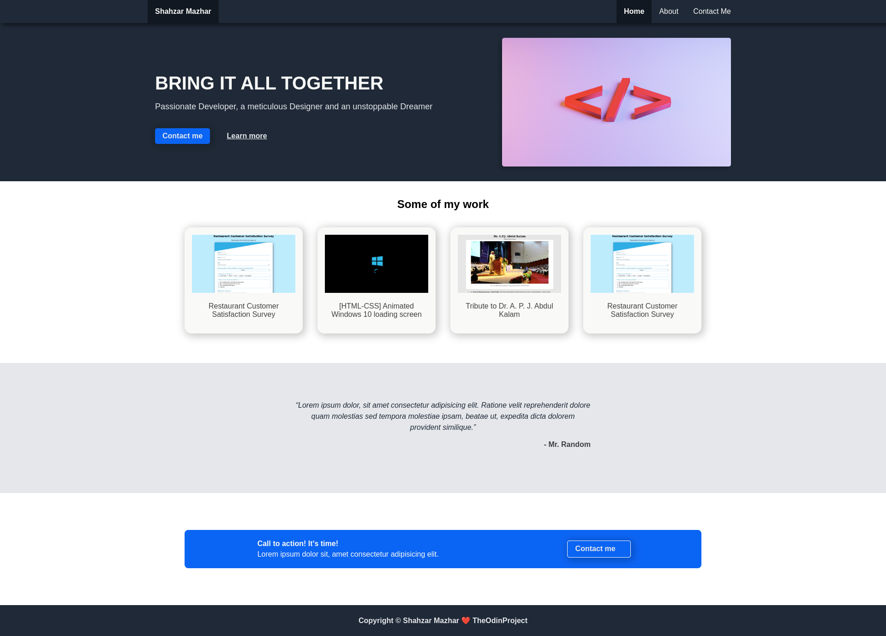

# LANDING PAGE

Project [Landing Page](https://www.theodinproject.com/lessons/foundations-landing-page) from [The Odin Projects](https://www.theodinproject.com).

## Learning Outcomes Summary

- Got the basics understanding of CSS
  - Adding styles to html with css
  - How to use class and id attributes
  - Add styles to specific elements using correct selectors
  - Box model and positioning
  - Block and inline elements
- Introduction to flexbox
  - Grow and shrink
  - Axes
  - Alignment
- Basics of Element Inspector
  - How to access the element inspector
  - How to select and inspect specific elements
  - How to use the element inspector to add styles to elements

## About This Project
This is a basic website landing page. There are 4 main sections (Hero, Projects, Testimonials, Action) and also a navbar and footer.

## Preview
Live: [https://szmazhr.github.io/odin-project-landing-page/](https://szmazhr.github.io/odin-project-landing-page/)

 

## Note
The outcomes listed above are not necessarily used in the project. They are just a summary of what I learned, through TheOdinProject's Curriculum, between previous projects and the current one.

## Credit
Hero Section Image by [Jackson Sophat](https://unsplash.com/@jacksonsophat) on [Unsplash](https://unsplash.com/).
